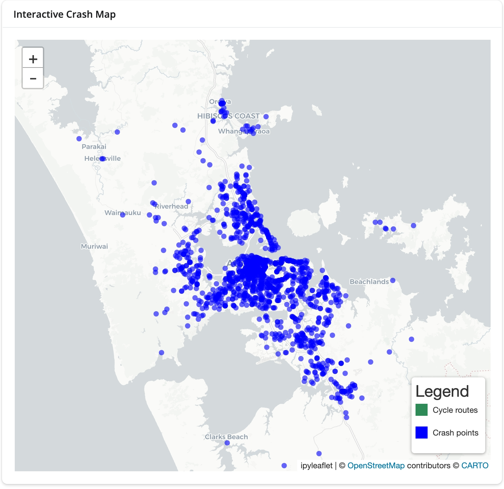
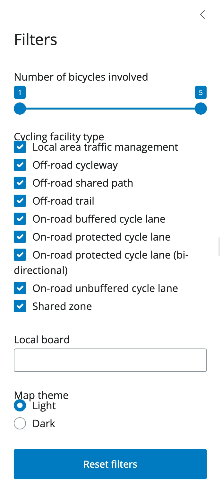
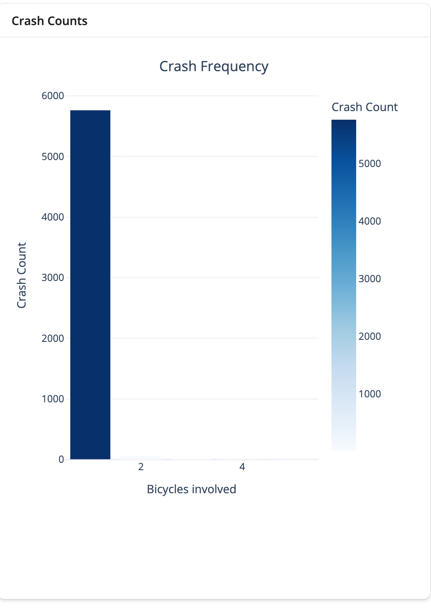
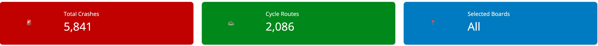

1. Motivation and audience. What problem does your dashboard address? Who is it for? What decision or insight does it enable?

THe problem that this adresses is Where are cyclist crashes concentrated, and how does this align with the cycle facility network. The first user it could be for is a cyclist. They might use this dashboard to understand where cycle crashes are concentrated, in order to possibly avoid or take extra care of any locations where cycle crashes are concentrated. Another user could be someone from a transport company such as AT. They could use this dashboard to see where cycle crashes are concentrated, then if this is not in the cycle network, it would show them places they need to make safer for cyclists. Otherwise if it is in the cycle network, it could let them know that part needs upgrading or the community needs some educating about the cycle network.

2. Data and preparation. Datasets used, variables, coverage, and cleaning steps. Limitations and coordinate-reference-system considerations.

The datasets that I used were the NZTA crash dataset and the AT cycle ways dataset. The variables I used were the number of bicycles involved in each crash (from 1-5)

3. Technical architecture. App structure, reactive dependency logic (inputs to calculations to outputs), key functions or classes, performance considerations. Include a simple diagram of the reactive structure (a Mermaid diagram rendered inside Quarto is ideal)

The app is structured like a normal shiny app, with data loading, app ui, and def server. There are a couple of reactive dependency logics. They are an input slider for the number of bicycles involved, a multi checkbox for the kind of cycling facility, and then a selectize for the local boards. These are all under a reactive calc, with a def filtered data. This enabled filtering of the map by the three categories.  

4. User interface walkthrough. Three to four screenshots. Explain how a user interacts with the app from start to insight.

The map is the main output. THe map shows bicycle crash points and cycle infrastructure. The filters in the filters picture filter the two elements. THe number of bicycles involved filters the crash points by the number of bicycles involved, the local board one is where you can filter the cycle infrastructure by local board, and the facility type does the same but with different facilities. Depending on what you select for all of these, the map will update to show you. Then looking at the counters, these show the total crashes, cycle routes, and local boards. All of these change depending on the selected filters, as the the graph in the graph picture. This enables an understanding of how cycle crashes are related to cycling infrastructure. 

5. Limitations and future improvements. Constraints you hit and how you would extend the app with more time.

One future improvement would be to be able to filter the crash locations by local board as well. This would make comparison with the cycle facitlies easier and more beneficial. Another limitation was the times of the crashes were not recorded, which would be helpful to know. THis would enable us to see if lots of the crashes were at peak hours or at night for example. 
